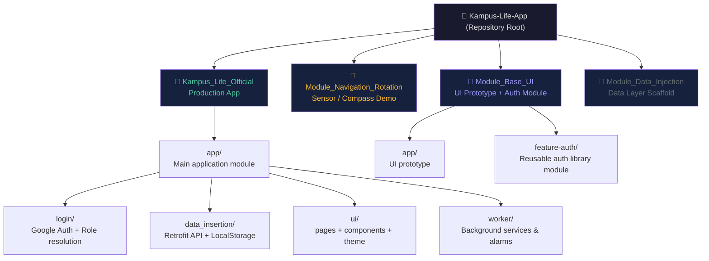
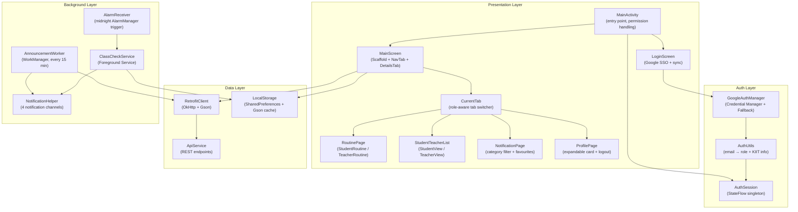
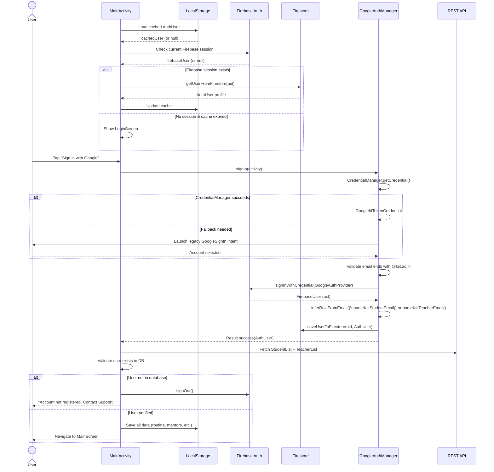
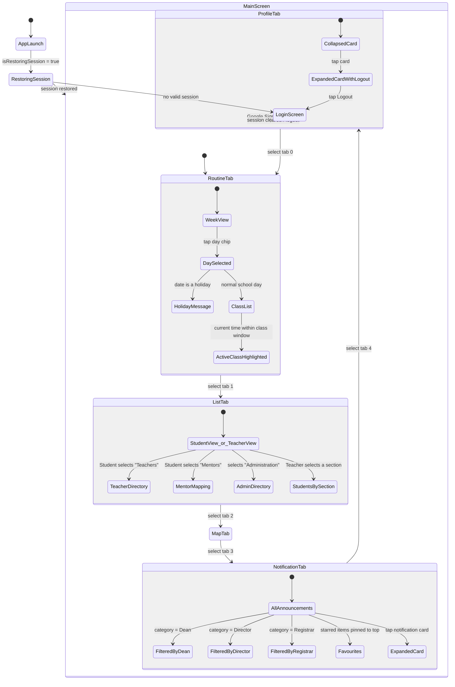
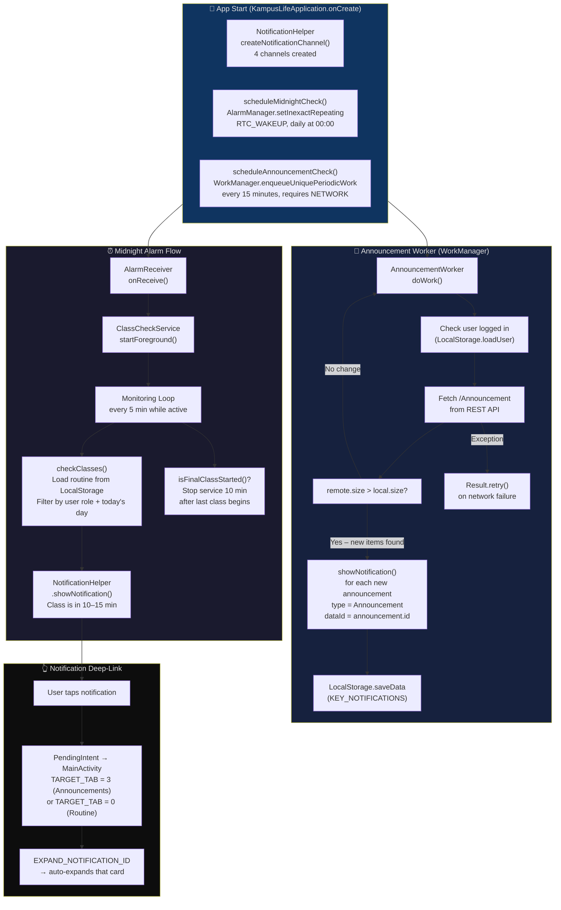
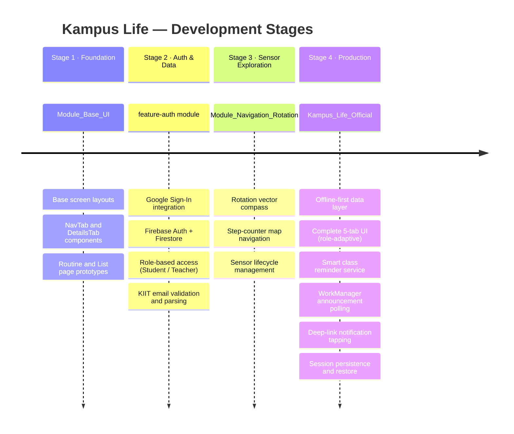

<div align="center">

# 🎓 Kampus Life

**The official companion app for KIIT University — built for students and faculty alike.**

[](https://kotlinlang.org/)
[](https://developer.android.com/)
[](https://developer.android.com/jetpack/compose)
[](https://firebase.google.com/)
[](LICENSE)

</div>

---

## 📋 Table of Contents

- [Overview](#-overview)
- [Repository Structure](#-repository-structure)
- [Kampus Life Official](#-kampus-life-official)
  - [Features](#features)
  - [Architecture](#architecture)
  - [Authentication Flow](#authentication-flow)
  - [Data Flow](#data-flow)
  - [App Navigation](#app-navigation)
  - [Background Services](#background-services)
  - [Tech Stack](#tech-stack)
- [Module: Navigation & Rotation](#-module-navigation--rotation)
  - [Features](#features-1)
  - [Sensor Pipeline](#sensor-pipeline)
- [Module: Base UI](#-module-base-ui)
- [Getting Started](#-getting-started)
- [Project Roadmap](#-project-roadmap)

---

## 🌟 Overview

**Kampus Life** is a full-featured Android application designed exclusively for [KIIT University](https://kiit.ac.in) staff and students. It centralises everything a student or teacher needs daily — class schedules, faculty directories, campus announcements, and a smart notification system — all behind a single KIIT Google Sign-In.

> 🔒 Access is restricted to verified `@kiit.ac.in` email addresses. The app automatically determines whether the signed-in user is a **Student** or **Teacher** and adapts the entire UI accordingly.

The repository is organised as a multi-module Android project, where each folder is an independent Android Studio project representing a specific stage or sub-system of the app.

---

## 🗂 Repository Structure



---

## 📱 Kampus Life Official

> **Path:** `Kampus_Life_Official/`  
> The production-ready Android app. Built entirely in Kotlin with **Jetpack Compose**, using Firebase for auth/storage and a custom REST API for all university data.

### Features

| Tab | Icon | Students | Teachers |
|-----|------|----------|----------|
| **Routine** | 📅 | Weekly timetable for their section. Active class highlighted in real-time. Holiday detection. | Full teaching schedule across all assigned sections. |
| **List** | 📋 | Browse faculty, view mentor–mentee mapping, access administration contacts. | Browse student lists by section, view administration. |
| **Map** | 🗺️ | Campus map view (integrated navigation module) | Campus map view |
| **Notifications** | 🔔 | Announcements from Dean / Director / Registrar. Favourites + category filter. | Same announcement feed. |
| **Profile** | 👤 | Name, roll number, section, department, email. Expandable card with logout. | Name, faculty position, department, email. |

Additional capabilities:
- ✅ **Offline-first** — all data is cached in SharedPreferences (JSON via Gson) and served instantly on app start
- ✅ **Smart class reminders** — foreground service notifies 10–15 minutes before each lecture
- ✅ **Alarm-sound first-class alert** — the first class of the day triggers an alarm-style notification
- ✅ **Announcement push** — WorkManager polls every 15 minutes for new campus announcements
- ✅ **Session persistence** — sessions survive restarts and are silently re-verified against Firebase

---

### Architecture

The app follows a **single-activity, component-based** architecture with Jetpack Compose managing all UI state reactively.



---

### Authentication Flow

The app enforces KIIT-only access and resolves each user's role automatically from their institutional email address.



---

### Data Flow

All data is fetched from a remote REST API and cached locally for offline access. On every app start the cache is served immediately while a background refresh runs silently.

```mermaid
flowchart LR
    subgraph Remote["☁️ Remote (REST API)"]
        direction TB
        EP1["/StudentList"]
        EP2["/TeacherList"]
        EP3["/Routine"]
        EP4["/MentorList"]
        EP5["/AdministrationList"]
        EP6["/Announcement"]
        EP7["/Holiday"]
    end

    subgraph NetworkLayer["🔌 Network Layer"]
        RC["RetrofitClient\n(OkHttp + Gson Converter)"]
        API["ApiService\n(Suspend functions)"]
    end

    subgraph Cache["💾 Local Cache (SharedPreferences)"]
        LS_S["student_data"]
        LS_T["teacher_data"]
        LS_R["routine_data"]
        LS_M["mentor_data"]
        LS_A["admin_data"]
        LS_N["notification_data"]
        LS_H["holiday_data"]
    end

    subgraph UI["📱 Compose UI"]
        SC["MainScreen\n(LaunchedEffect)"]
        TABS["Tab Pages\n(remember + mutableStateOf)"]
    end

    Remote --> RC --> API
    API -->|"Fetched data"| SC
    SC -->|"If changed → save"| Cache
    Cache -->|"Loaded on startup\n(offline-first)"| SC
    SC --> TABS

    style Remote fill:#0f3460,color:#e0e0e0
    style NetworkLayer fill:#16213e,color:#e0e0e0
    style Cache fill:#1a1a2e,color:#e0e0e0
    style UI fill:#0f3460,color:#e0e0e0
```



#### Data Models

| Model | Key Fields | API Endpoint |
|-------|-----------|--------------|
| `StudentList` | `roll`, `name`, `email`, `phone`, `section` | `/StudentList` |
| `TeacherList` | `roll`, `name`, `email`, `phone`, `cabin`, `sections[]` | `/TeacherList` |
| `Routine` | `section`, `subject`, `day`, `time`, `teacher`, `classroom` | `/Routine` |
| `MentorList` | `mentor: TeacherList`, `mentee: List<StudentList>` | `/MentorList` |
| `AdministrationList` | `name`, `designation`, `department`, `cabin` | `/AdministrationList` |
| `Notification` | `sender`, `receiver`, `subject`, `body`, `sendTime` | `/Announcement` |
| `Holiday` | `dateString`, `event` | `/Holiday` |

---

### App Navigation

The app uses a custom bottom navigation bar (`NavTab`) with a context-sensitive top bar (`DetailsTab`) that changes its category chips based on the active tab and user role.



---

### Background Services

The app runs three independent background mechanisms to keep users informed even when the app is closed.



#### Notification Channels

| Channel ID | Name | Priority | Sound | Use Case |
|------------|------|----------|-------|----------|
| `routine_first_notifications` | First Class Alert | HIGH | 🔔 Alarm | First lecture of the day |
| `routine_general_notifications` | Class Reminders | HIGH | 🔔 Notification | Subsequent lectures |
| `announcement_notifications` | Announcements | DEFAULT | 🔔 Notification | New campus announcements |
| `kampus_life_service` | Monitoring Service | LOW | Silent | Ongoing foreground service |

---

### Tech Stack

| Layer | Technology | Version |
|-------|-----------|---------|
| Language | Kotlin | 2.3.10 |
| UI Framework | Jetpack Compose (BOM) | 2024.09.00 |
| Min SDK | Android 8.0 (Oreo) | API 26 |
| Target / Compile SDK | Android 16 | API 36 |
| Authentication | Firebase Auth + Google Credential Manager | Firebase BOM 33.10.0 |
| Auth Fallback | Google Sign-In (legacy) | play-services-auth 21.5.1 |
| User Profiles | Firebase Firestore | Firebase BOM 33.10.0 |
| Networking | Retrofit 3 + OkHttp 5 + Gson | 3.0.0 / 5.3.2 |
| Offline Cache | SharedPreferences + Gson | 2.13.2 |
| Image Loading | Coil (Compose) | 2.7.0 |
| Background Tasks | WorkManager | 2.10.0 |
| Foreground Service | Android Service + AlarmManager | — |
| Coroutines | kotlinx.coroutines | 1.10.2 |
| Build | Gradle (Kotlin DSL) + Version Catalog | AGP 9.0.1 |

---

## 🧭 Module: Navigation & Rotation

> **Path:** `Module_Navigation_Rotation/`  
> A self-contained Android module that demonstrates real-time **device orientation tracking** and **step-based map navigation** using hardware sensors. Built with traditional Android Views (AppCompat), not Compose.

### Features

- 🧲 **Compass** — reads the device's Rotation Vector Sensor to compute the magnetic azimuth (0°–360°), smoothed using a configurable low-pass filter (`smoothingFactor = 0.1`)
- 🚶 **Pedometer** — uses the hardware Step Counter sensor to count steps since the session began
- 🗺️ **Map simulation** — a background `ImageView` rotates with the compass heading and translates (pans) in the direction of travel with each step
- 🔒 **Permission handling** — requests `ACTIVITY_RECOGNITION` at runtime on Android Q+
- ⏱️ **Sensor timeout** — if sensors fail to initialise within 10 seconds, a loading overlay is hidden and the user is notified

### Sensor Pipeline

```mermaid
flowchart TD
    subgraph Hardware["📡 Device Hardware"]
        RVS["Rotation Vector Sensor\n(TYPE_ROTATION_VECTOR)"]
        SC["Step Counter Sensor\n(TYPE_STEP_COUNTER)"]
    end

    subgraph SensorManager["🔁 SensorManager (SENSOR_DELAY_GAME)"]
        onSC["onSensorChanged(event)"]
    end

    subgraph CompassPipeline["🧭 Compass Pipeline"]
        RM["getRotationMatrixFromVector()\n→ 3×3 rotation matrix"]
        OA["getOrientation()\n→ orientationAngles[3]"]
        AZ["azimuthRad → azimuthDeg\nnormalizeAngle() → 0°–360°"]
        PITCH["Pitch filter\n|pitch| < 80° → accept reading\n(rejects face-up/down)"]
        ROT_VAL["rotationVal updated"]
        SMOOTH["updateArrowRotation()\nshortestAngleDiff() + smoothingFactor\nbg.rotation = current + diff × 0.1"]
        TV_MAG["tvMagnetometer.text\n= \"Compass: ${azimuth}°\""]
    end

    subgraph PedometerPipeline["🚶 Pedometer Pipeline"]
        INIT_STEP["initialStepCount set on\nfirst event (session baseline)"]
        STEP_DIFF["stepDiff = currentSteps − lastStepValue"]
        MOVE["calculateMovementDirection(stepDiff, azimuthRad)\nmoveX = sin(az) × scale × diff × 0.5\nmoveY = cos(az) × scale × diff × 0.5"]
        ANIM["bg.animate()\n.translationXBy(−moveX)\n.translationYBy(moveY)\n.duration(200ms)"]
        TV_GYRO["tvGyrometer.text\n= \"Pedometer: $stepsSinceMapResume\""]
    end

    subgraph Lifecycle["♻️ Activity Lifecycle"]
        RESUME["onResume()\nregisterListener() for both sensors\nstart 10s timeout handler"]
        PAUSE["onPause()\nunregisterListener()\nreset initialStepCount\ncancel timeout"]
    end

    Hardware --> SensorManager
    SensorManager --> onSC
    onSC -->|"TYPE_ROTATION_VECTOR"| RM --> OA --> AZ --> PITCH --> ROT_VAL --> SMOOTH --> TV_MAG
    onSC -->|"TYPE_STEP_COUNTER"| INIT_STEP --> STEP_DIFF --> MOVE --> ANIM --> TV_GYRO
    Lifecycle --> SensorManager

    style Hardware fill:#0f3460,color:#e0e0e0
    style CompassPipeline fill:#16213e,color:#e0e0e0
    style PedometerPipeline fill:#1a1a2e,color:#e0e0e0
    style Lifecycle fill:#0d0d0d,color:#e0e0e0
```

---

## 🎨 Module: Base UI

> **Path:** `Module_Base_UI/`  
> A UI prototype and reusable auth library that served as the development sandbox before `Kampus_Life_Official`. Contains a **`feature-auth`** library module with a thorough [Role-Based Access Guide](Module_Base_UI/feature-auth/ROLE_ACCESS_GUIDE.md).

**`feature-auth` key exports:**

| Export | Type | Description |
|--------|------|-------------|
| `AuthSession` | `object` (singleton) | Holds the current `AuthUser` as a `StateFlow`; cleared on logout |
| `AuthUser` | `data class` | Complete user model (role, email, roll, department, uid, photo) |
| `UserRole` | `enum` | `STUDENT`, `TEACHER`, `UNKNOWN` |
| `AuthUtils` | Functions | `inferRoleFromEmail()`, `parseKiitStudentEmail()`, `parseKiitTeacherEmail()` |

> See [`ROLE_ACCESS_GUIDE.md`](Module_Base_UI/feature-auth/ROLE_ACCESS_GUIDE.md) for complete integration examples, Firestore security rules, and ViewModel patterns.

---

## 🚀 Getting Started

### Prerequisites

| Tool | Minimum Version |
|------|----------------|
| Android Studio | Ladybug (2024.2+) |
| JDK | 11 |
| Android SDK | API 26+ |
| Gradle | Managed via wrapper (`./gradlew`) |

### 1 — Clone the repository

```bash
git clone https://github.com/Aritra-Chats/Kampus-Life-App.git
cd Kampus-Life-App
```

### 2 — Open the target project

Each sub-folder is an independent Android Studio project. Open the one you want to work on:

| Module | Path to open in Android Studio |
|--------|-------------------------------|
| Production app | `Kampus_Life_Official/` |
| Sensor demo | `Module_Navigation_Rotation/` |
| UI prototype | `Module_Base_UI/` |

### 3 — Configure Firebase (Kampus_Life_Official only)

The `google-services.json` files are already present for reference. For your own Firebase project:

1. Create a project at [console.firebase.google.com](https://console.firebase.google.com)
2. Enable **Authentication → Google** sign-in
3. Enable **Firestore Database**
4. Download your `google-services.json` and replace `Kampus_Life_Official/app/google-services.json`
5. Update `webClientId` in `GoogleAuthManager.kt` with your OAuth 2.0 Web Client ID

### 4 — Build & run

```bash
# From the module directory (e.g. Kampus_Life_Official/)
./gradlew assembleDebug
```

Or use the **Run** button in Android Studio with a connected device / emulator running API 26+.

---

## 🗺️ Project Roadmap



---

<div align="center">

**Built with ❤️ for KIIT University**  
*Contributions, bug reports, and feature requests are welcome via [Issues](https://github.com/Aritra-Chats/Kampus-Life-App/issues) and [Pull Requests](https://github.com/Aritra-Chats/Kampus-Life-App/pulls).*

</div>